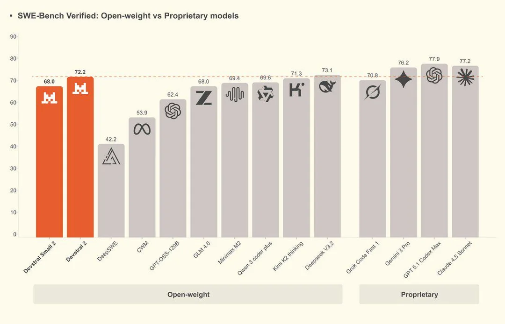
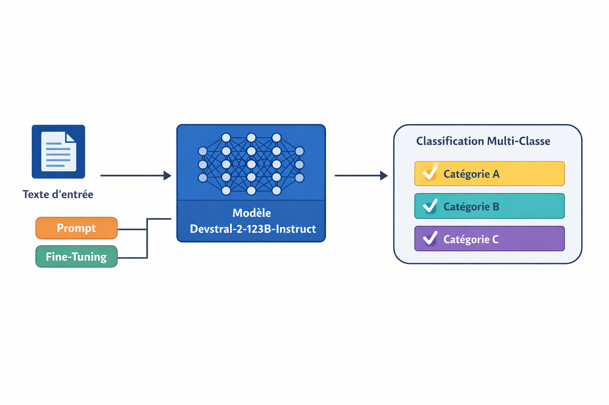

# Note méthodologique : Preuve de Concept

## I- Dataset 

Le dataset référence 1050 articles vendus sur une marketplace.
Chacun de ces articles appartient à l'une des 7 catégories d'articles existantes. 

Les articles sont identifiés à l'aide d'un id unique et les catégories sont référencées dans la feature "product_category_tree".

Il n'y a pas de doublon parmi les articles.

Il n'y a aucun biais de représentativité dans les 7 catégories :

product_category
Home Furnishing               150
Baby Care                     150
Watches                       150
Home Decor & Festive Needs    150
Kitchen & Dining              150
Beauty and Personal Care      150
Computers                     150

Les descriptions textuelles associées à chacun des articles correspondent à la feature "description". 
Le nombre de caratères et le nombre de mots dans chacune des descriptions sont variables :

nombre de mots par descprition d'articles : 

count    1050.000000
mean       76.202857
std        74.851233
min        13.000000
25%        30.000000
50%        44.000000
75%        94.000000
max       587.000000

Enfin, on peut s'intéresser lors des analyses préliminaires aux distributions des mots par catégorie afin potentiellement, ultérieurement, d'essayer de conclure sur une éventuelle corrélation entre le nombre de mots et la bonne classification des articles dans certaines catégories.

## II- Concept de l'algorithme

### Généralités

Devstral est un modèle de langage spécialisé pour les agents logiciels et la génération de code, mais sa nature de LLM instructif lui permet également d’être utilisé pour des tâches de NLP classiques, comme la classification de textes, le résumé ou l’extraction d’information.
La version utilisée dans ce travail est Devstral‑2‑2512.

Devstral 2 est un modèle open source de pointe développé par Mistral AI, spécialisé dans le codage agentique. Il s'agit d'un modèle de transformateur dense à 123 milliards de paramètres prenant en charge une fenêtre contextuelle de 256 000 caractères.
L’objectif du modèle était de créer une version rapide, légère et efficace, adaptée à des usages agentiques tout en restant performant malgré une taille réduite.

Il s'inscrit dans la catégorie des grands modèles de langage souvent employés pour générer ou assister dans du code logiciel mais a été élaboré avec l'ajout de spécialisations agentiques, c’est‑à‑dire des ajustements et adaptations pour des interactions de style agent (compréhension contextuelle, génération de code, pipelines logiciels).

Il a été designé et *fine-tuné* pour des tâches de génération, chat ou tâches agentiques pour le développement logiciel.

Il existe plusieurs versions : la version “Small” (~24 B paramètres) et la version “Instruct” complète (~123 B paramètres), cette dernière étant optimisée pour suivre des instructions complexes et gérer des bases de code étendues.

La version initiale a été publiée en août 2025.
https://arxiv.org/abs/2509.25193

### Performances et sécurité

Devstral‑2 montre des résultats significativement élevés, dépassant de nombreux modèles open source populaires.

- taille du modèle fixée autour de 24 B paramètres pour assurer rapidité et faible empreinte.
- conception pour servir facilement en production (facilité de déploiement, temps de réponse, efficacité).
- Devstral‑Small atteint des performances compétitives comparées à des modèles plus de dix fois plus gros sur des tâches liées au codage logiciel et aux agents logiciels.

Sécurité et robustesse : Le modèle intègre des mécanismes de filtrage et de suivi des instructions, ce qui limite la génération de contenu inapproprié. 

### Concept de l'algorithme

Devstral est un transformer LLM entraîné pour comprendre et générer du code ainsi que pour agir comme agent logiciel.

Il fonctionne sur le principe de prédiction de token suivant, enrichi par un fine-tuning orienté instructions pour améliorer la capacité à suivre des consignes complexes dans des environnements logiciels et interpréter des consignes complexes pour générer ou classer du texte.

Le modèle peut gérer de très longs contextes (jusqu’à 256 000 tokens), permettant de traiter des projets volumineux de manière cohérente.

Adaptation NLP : Pour la classification multi-classe, le modèle est utilisé pour générer la catégorie attendue à partir d’un texte donné, soit via prompt clair, soit via fine-tuning léger sur un dataset annoté.

## III- Modélisation

### Spécificités architecturales du modèle

Architecture transformer classique avec modifications pour agents logiciels.

123 milliards de paramètres dans la version Instruct.

Optimisations pour latence et gestion de mémoire lors de l’inférence sur projets de code volumineux.

Capacité de long context window pour maintenir la cohérence sur plusieurs fichiers ou fonctions.

Adapté pour le traitement séquentiel de données textuelles ou de code, avec une cohérence sur plusieurs entrées.

### Données et stratégies d'entrainement

Corpus de code multi-langages provenant de bases open-source et de dépôts privés (avec licence).

Fine-tuning instructif pour améliorer la compréhension des consignes, la génération de code et la gestion de pipelines multi-fichiers.

Techniques : mélange de pré-entraînement général + fine-tuning agentique, parfois accompagné de RLHF (Reinforcement Learning from Human Feedback) pour la conformité et la sécurité.

### Fonction de perte : 

Cross-entropy loss pour la prédiction de token suivant, standard dans les LLM.

Ajustements spécifiques pour les tâches instructives afin de prioriser la conformité aux instructions et la cohérence de génération multi-fichiers.

### Métriques d'évaluation :

SWE-bench pour la performance en développement logiciel.

Exact match (EM) et code execution accuracy pour évaluer la précision du code généré.

Mesures de suivi d’instructions pour la qualité de réponse dans des contextes agentiques.

Temps d’inférence et consommation mémoire pour l’évaluation de l’efficacité pratique.

## Synthèse des résultats

Accuracy : 0.84 → 84 % des produits sont correctement classés.

Macro F1-score : 0.86 → performance moyenne sur toutes les catégories.

Weighted F1-score : 0.85 → performance moyenne pondérée par le nombre d’exemples par catégorie.

Globalement, le modèle est plutôt performant pour ce type de classification multi-classes.

Précision élevée sur la plupart des catégories.

Comme constaté lors du projet 6 : Home Furnishing et Home Decor & Festive Needs sont problématiques.

- Home Decor & Festive Needs : beaucoup de produits d’autres catégories classés ici → faux positifs.
- Home Furnishing : beaucoup de vrais produits non reconnus → faux négatifs.
→ Ces catégories sont probablement proches lexicalement dans les descriptions, ce qui crée des confusions.

Autres catégories : Baby Care, Beauty, Computers, Kitchen & Dining et Watches sont très fiables.

## Analyse de la feature importance locale et globale

Pour un modèle basé sur texte comme un LLM, les “features” sont les tokens du texte.
La feature importance globale mesure l’importance moyenne de chaque mot ou token pour la classification sur l’ensemble du dataset.
La feature importance locale mesure l’influence de chaque mot ou segment de texte pour un exemple donné.

On peut évaluer une importance locale approximative directement depuis le LLM, avec une approche rapide “prompt-based explainability”.

## Limitations et améliorations possibles

Modèle utilisable pour tri rapide de produits : 84 % de réussite globale.

Améliorations possibles :

- raffiner le prompt pour mieux distinguer Home Furnishing / Home Decor & Festive Needs.

- ajouter des exemples supplémentaires pour les catégories ambigües.
