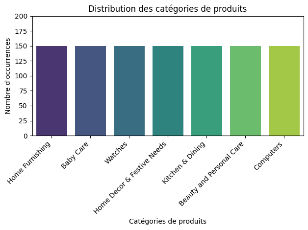
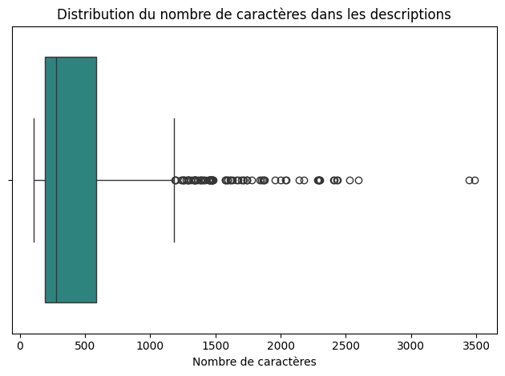
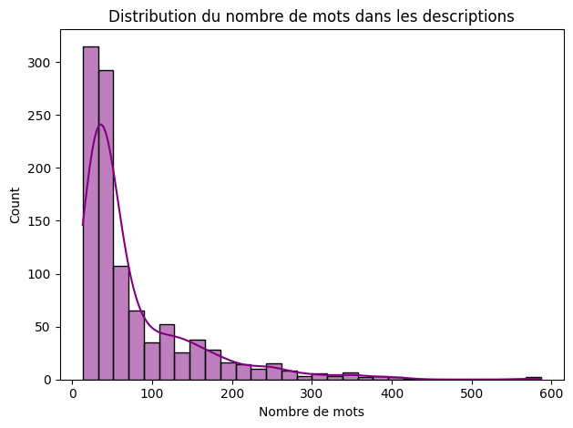
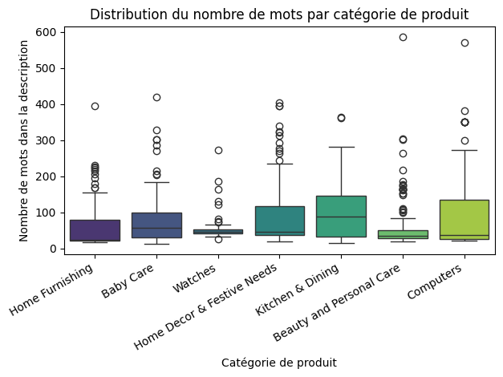
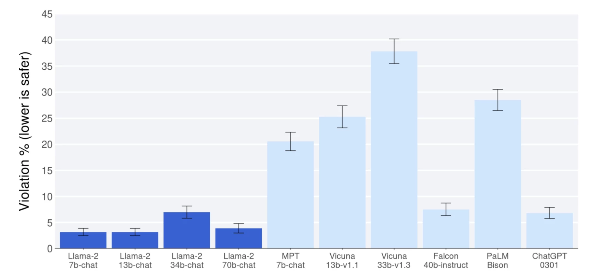
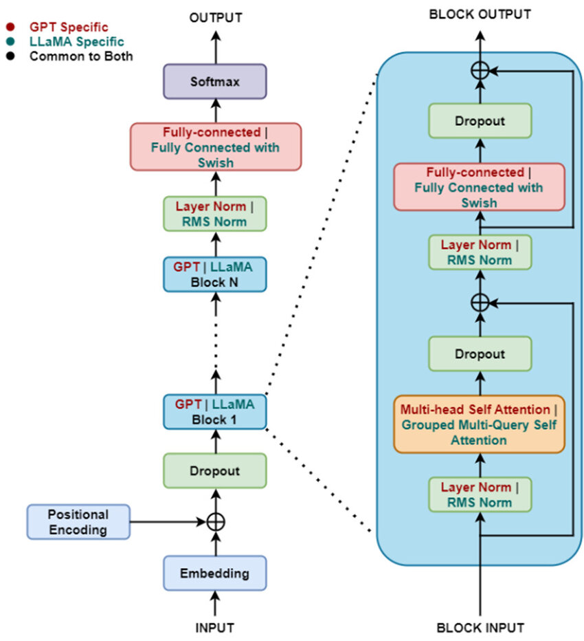

# Note méthodologique : Preuve de Concept

## I- Dataset 

Le dataset référence 1050 articles vendus sur une marketplace.
Chacun de ces articles appartient à l'une des 7 catégories d'articles existantes. 

Les articles sont identifiés à l'aide d'un id unique et les catégories sont référencées dans la feature "product_category_tree".

Il n'y a pas de doublon parmi les articles.

Il n'y a aucun biais de représentativité dans les 7 catégories :

product_category
Home Furnishing               150
Baby Care                     150
Watches                       150
Home Decor & Festive Needs    150
Kitchen & Dining              150
Beauty and Personal Care      150
Computers                     150

Les descriptions textuelles associées à chacun des articles correspondent à la feature "description". 
Le nombre de caratères et le nombre de mots dans chacune des descriptions sont variables :

nombre de mots par descprition d'articles : 

count    1050.000000
mean       76.202857
std        74.851233
min        13.000000
25%        30.000000
50%        44.000000
75%        94.000000
max       587.000000

Enfin, on peut s'intéresser lors des analyses préliminaires aux distributions des mots par catégorie afin potentiellement, ultérieurement, d'essayer de conclure sur une éventuelle corrélation entre le nombre de mots et la bonne classification des articles dans certaines catégories.

## II- Concept de l'algorithme

### Généralités

Llama 2 est une famille de modèles linguistiques causaux autorégressifs, développée par Meta AI, basés sur des transformeurs. Les modèles linguistiques autorégressifs prennent une séquence de mots en entrée et prédisent récursivement en sortie le(s) mot(s) suivant(s).

Llama-2-chat est affiné pour les cas d'utilisation axés sur le dialogue et un assistant de code code-LlaMA.

La version initiale a été publiée en février 2023, en quatre tailles différentes : 7, 13, 33 et 65 milliards de paramètres.
https://arxiv.org/abs/2307.09288

Il prend en entrée du texte et génère du texte en sortie (pas de multimodalité).

LLAMA 2 excelle dans la compréhension du langage naturel grâce à son entraînement massif (environ 2 000 milliards de tokens) et à la diversité de ses sources de données. Il est ainsi capable de :

- Analyser, interpréter et répondre à des questions complexes
- Résumer des textes longs
- Extraire des informations clés
- Comprendre le contexte implicite d’une conversation ou d’un document

L’un des aspects les plus marquants de LLAMA 2 est son statut open source. Meta a choisi de publier le modèle sous une licence permissive qui autorise la recherche et l’utilisation commerciale.
Cette ouverture favorise l’innovation collaborative, la transparence et l’auditabilité du modèle. Elle permet également aux développeurs et aux entreprises d’adapter LLAMA 2 à leurs besoins spécifiques, de l’intégrer dans leurs applications, mais aussi de le peaufiner (fine-tuning) sur des jeux de données privés pour des cas d’usage spécialisés.

### Performances et sécurité

LLaMA 2 surpasse de nombreux modèles open-source existants sur la plupart des benchmarks testés.

Des évaluations humaines ont été utilisées pour mesurer à la fois la pertinence des réponses et la sécurité des comportements générés.

Un effort particulier a été porté sur le fine-tuning pour améliorer la sécurité et la pertinence des réponses, en intégrant plus d’un million d’annotations humaines pour affiner le comportement du modèle.

### Concept de l'algorithme

LLaMA 2 est un modèle Transformer auto-régresseur (decoder-only).
Il prend en entrée une séquence de tokens et prédit le token suivant en sortie, il réitère ce processus pour générer du texte de façon itérative.

Il utilise une architecture type transformer avec des mécanismes d'attention multi-têtes (self-attention), c'est à dire qui vont pondérer chacun des éléments de la séquence en fonction des autres. Ces mécanismes de self-attention permettent au modèle d'apprendre les relations entre tokens (syntaxe, relations sémantiques, dépendances longues, grammaire, structure du langage, etc).
Llama 2 utilise une attention causale, c'est à dire que chaque token ne peut voir que les tokens précédents (process auto-regressif), le mask empêche de regarder le futur.

## III- Modélisation

La méthodologie de modélisation de LLaMA 2 repose sur un Transformer auto-régresseur entraîné par prédiction du token suivant, puis affiné par apprentissage supervisé et par renforcement à partir de retours humains. L’évaluation combine des métriques automatiques classiques et des évaluations humaines, tandis que l’optimisation vise un compromis entre performance, stabilité et coût de calcul.

### Spécificités architecturales du modèle

LLaMA 2 repose sur une architecture Transformer moderne optimisée, composée de blocs répétés comprenant :

1- Self-attention causale multi-têtes
2- RMSNorm (normalisation)
3- MLP avec SwiGLU
4- Connexions résiduelles

Spécificités architecturales de LlaMA2 :

- RoPE (Rotary Positional Embeddings) pour encoder la position des tokens
- RMSNorm pour une normalisation plus efficace que LayerNorm
- SwiGLU comme mécanisme de gating dans les couches fully-connected
- Grouped-Query Attention (GQA) pour réduire les coûts mémoire (surtout pour les grands modèles)

1- RoPE [Rotary Positional Embeddings] : gère l'information de position des tokens.
Avant on ajoutait un vecteur de position au vecteur d'embedding du token; RoPE encode la position comme une rotation, pas comme une addition :
- chaque mot est un point dans l’espace vectoriel
- la position du mot correspond à un angle de rotation
- deux mots proches ont des rotations proches

=> Le modèle apprend les distances relatives entre les mots
=> plus performant sur les séquences longues

2- RMSNorm – Root Mean Square Normalization

On normalise les valeurs pour éviter les explosions ou disparitions de gradients et assurer la stabilité des entrainements.
RMSNorm est une version simplifiée et plus efficace de LayerNorm.

- LayerNorm : centralise et norme
- RMSNorm : normalise directement sans recentrage

=> plus rapide (temps de calculs réduit), plus stable, moins coûteux en mémoire

3- SwiGLU ou Switch

SwiGLU est un mécanisme de gating utilisé à l’intérieur du bloc fully-connected du transformer.
SwiGLU combine une activation (Swish) + une porte (GLU).
Elle permet de moduler dynamiquement l’information transmise entre les couches fully-connected, elle sert de filtre de l'information.

### Données et stratégies d'entrainement

1- pré-entrainement auto-supervisé sur des données massives 
=> objectif : prédire le token suivant
2- fine_tuning supervisé 
=> objectif : améliorer l’utilité et la pertinence des réponses [assistant instructionnel]
3- alignement par RLHF [Reward maximization]: 
Génération de plusieurs réponses pour une même instruction -> Classement des réponses par des évaluateurs humains -> Entraînement d’un modèle de récompense
=> Le modèle apprend à :
- produire des réponses préférées par les humains
- réduire les comportements indésirables
- améliorer la sécurité et la cohérence

### Fonction de perte : 

- [1 et 2] : cross-entropy 
- [3] : optimisation du modèle via PPO (Proximal Policy Optimization)

### Métriques d'évaluation :

Contrairement aux modèles classiques, l’évaluation de LLaMA 2 repose sur une combinaison de métriques automatiques et humaines.

Métriques automatiques :

1- Perplexité

- Mesure la capacité du modèle à prédire le texte
- Plus la perplexité est basse, meilleur est le modèle
- Utilisée principalement lors du pré-entraînement

2- Benchmarks NLP standards

- compréhension de texte
- raisonnement logique
- génération contrôlée

=> Permettent de comparer LLaMA 2 à d’autres modèles open-source.

2- Évaluation humaine (plus particulièrement pour LLaMA 2-Chat)

- jugement de la qualité des réponses
- comparaison directe entre modèles
- critères :
    - utilité
    - clarté
    - sécurité
    - alignement avec l’intention utilisateur

=> Métriques humaines principales pour les modèles Chat.

3- Métriques de sécurité et robustesse

- tests dédiés aux réponses sensibles
- Évaluation des biais, hallucinations et comportements à risque

## Synthèse des résultats

## Analyse de la feature importance locale et globale

## Limitations et améliorations possibles